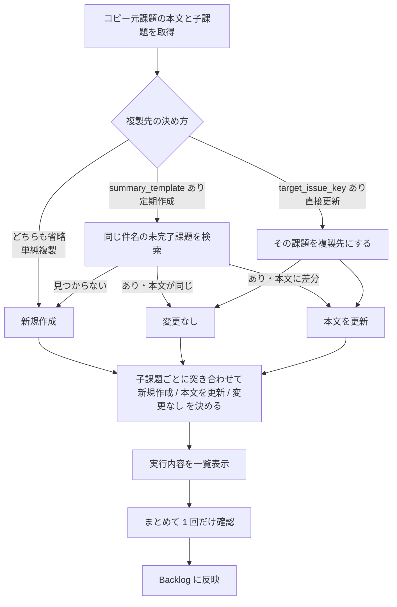

# backlog_issue_cloner

Backlog の課題を、 **子課題ごとまとめて複製する** CLI ツール。

定例の点検手順や週次タスクをテンプレート課題として用意しておき、そこから実体を起こします。
同じ件名の課題が既にあれば作らず本文だけ更新するため、繰り返し実行しても重複しません。

## 主要機能

- **子課題ごと複製** : 親課題を指定すると、その子課題もまとめて複製する
- **3 つの動作モード** : 単純複製 / 定期作成 / 直接更新。設定 2 項目の有無だけで切り替わる
- **属性の引き継ぎ** : 種別・優先度・担当者・カテゴリー・カスタム属性をコピー元から引き継ぐ
- **実行前に一覧表示** : 親子あわせて何を作成・更新するかを示し、確認は 1 回だけ
- **事故防止** : プロジェクトを跨いだ複製を禁止。更新系は二重作成しない条件でのみ再試行する
- **対話メニュー** : CLI オプションを覚えなくても、番号を選ぶだけで実行できる

---

## 目次

**入門**
1. [クイックスタート](#クイックスタート)
2. [動作要件](#動作要件)

**使い方ガイド**
3. [メニューから実行する](#1-メニューから実行する)
4. [コマンドから実行する](#2-コマンドから実行する)
5. [複製の仕方を選ぶ](#3-複製の仕方を選ぶ)
6. [子課題ごと複製する](#4-子課題ごと複製する)
7. [カスタム属性を引き継ぐ](#5-カスタム属性を引き継ぐ)
8. [自動実行する](#6-自動実行する)
9. [実行例](docs/EXAMPLES.md)

**リファレンス**
10. [複製される項目](#複製される項目)
11. [設定ファイル](#設定ファイル)
12. [CLI オプション一覧](#cli-オプション一覧)
13. [重複判定の挙動](#重複判定の挙動)
14. [エラー時のリトライ](#エラー時のリトライ)
15. [Exit code](#exit-code)
16. [既知の制約](#既知の制約)
17. [ファイル構成](#ファイル構成)

**開発者向け**
18. [設計方針](#設計方針)
19. [テスト](#テスト)
20. [変更履歴](#変更履歴)

---

## クイックスタート

**メニューから使う** （CLI オプションを覚えなくてよい）:

```cmd
:: Windows: menu.bat をダブルクリック、またはコマンドから
cd C:/tools/backlog_issue_cloner
menu.bat
```

```bash
# macOS / Linux
cd ~/ws/backlog_issue_cloner
python3 menu.py
```

**CLI から使う** :

```bash
# 1. 接続情報だけ設定する
cp config.sample.yaml config.yaml

# 2. まずドライランで確認（既定。何も書き換えない）
python3 backlog_issue_cloner.py --source-issue-key PROJ-10

# 3. 問題なければ実行
python3 backlog_issue_cloner.py --source-issue-key PROJ-10 --execute
```

`config.yaml` に最低限必要なのは接続情報だけです。

```yaml
backlog:
  space_host: "myteam.backlog.com"
  api_key: "YOUR_API_KEY_HERE"
```

複製の対象は実行のたびにメニューかコマンドラインで指定します。
設定ファイルに固定しておくこともできます（[設定ファイル](#設定ファイル)）。

---

## 動作要件

- **Python 3.10 以上** （`int | None` 形式の型注釈を使用）
- 依存は **PyYAML のみ**

```bash
pip3 install pyyaml
```

`config.yaml` は API キーを含むため `.gitignore` で除外されています。

> このドキュメントのコマンドは `python3` 表記です。
> Windows では `python` または `py -3` に読み替えてください。`menu.bat` は自動で判別します。

---

## 使い方ガイド

### 1. メニューから実行する

CLI オプションを覚えなくても、番号を選ぶだけで実行できます。

```cmd
:: Windows はこれをダブルクリック
menu.bat
```

```bash
# コマンドから起動する場合
python3 menu.py
```

```

============================================================
  Backlog 課題クローン
============================================================
  接続先: myteam.backlog.com

============================================================
  モードを選択
============================================================
  1. 単純複製 ― 課題を子課題ごとそのままコピーする（毎回新規作成）
  2. 定期作成 ― 日付入りの件名で作成する。既にあれば本文だけ更新する
  3. 直接更新 ― 既存の課題（と子課題）にコピー元の本文を反映する
------------------------------------------------------------
  0. 終了
============================================================
```

モードを選ぶと、必要な項目だけを順に尋ねます。

| モード | 尋ねる項目 |
| --- | --- |
| 単純複製 | コピー元の課題キー |
| 定期作成 | コピー元の課題キー / 件名テンプレート / 日付 |
| 直接更新 | コピー元の課題キー / 複製先の課題キー |

- **件名テンプレートに `{YYYYMMDD}` が無い場合は日付を尋ねません** （結果に影響しないため）
- 日付は「今日 / 明日 / 来週の月曜 / 手動入力」から選びます
- 最後にドライランか実行かを選びます。 **実行内容の一覧と最終確認は本体が表示します**
- 接続設定を切り替える場合は `python3 menu.py --config other.yaml`

入力値は `~/.backlog_issue_cloner_menu.json` に記憶され、次回の既定値になります。

> 無人実行（cron・タスクスケジューラ）ではメニューではなく `backlog_issue_cloner.py` を直接呼んでください。

3 つのモードそれぞれについて、入力から結果までを通しで載せた実行例が
[docs/EXAMPLES.md](docs/EXAMPLES.md) にあります。

### 2. コマンドから実行する

**既定はドライラン** です。実際には何も作成・更新されません。

```bash
python3 backlog_issue_cloner.py
```

実際に反映するには `--execute` を付けます。実行前に確認プロンプトが出ます。

```bash
python3 backlog_issue_cloner.py --execute
```

設定ファイルの `clone` セクションはコマンドラインで上書きできます。
接続情報だけを設定ファイルに置き、複製の対象を実行時に指定する使い方ができます。

```bash
# 単純複製を 1 回だけ実行する
python3 backlog_issue_cloner.py --source-issue-key PROJ-10 --execute

# 既存の課題群にテンプレートの本文を反映し直す
python3 backlog_issue_cloner.py --source-issue-key PROJ-10 \
    --target-issue-key PROJ-20 --execute
```

実行内容は親子まとめて一覧表示され、 **確認は 1 回だけ** です。

```
実行内容:
  [親] 本文を更新  9月 月次点検（PROJ-20）
  [子] 変更なし    手順1 バックアップ（PROJ-21）
  [子] 本文を更新  手順2 検証（PROJ-22）
  [子] 新規作成    手順3 報告
  Backlog に反映しますか？（新規作成 1 件 / 本文更新 2 件） [y/N]: y
更新完了: PROJ-20 ― 9月 月次点検
  [子] 更新完了: PROJ-22 ― 手順2 検証
  [子] 作成完了: PROJ-101 ― 手順3 報告
```

### 3. 複製の仕方を選ぶ

`summary_template` と `target_issue_key` の **有無だけ** で 3 通りに変わります。

| 設定 | モード | 動作 |
| --- | --- | --- |
| どちらも省略 | **単純複製** | 重複チェックをせず、実行のたびに新しい課題を作る |
| `summary_template` あり | **定期作成** | その件名の課題を探し、無ければ作成・あれば更新 |
| `target_issue_key` あり | **直接更新** | 検索せずその課題を更新 |

**単純複製** ― コピー元の件名をそのまま使い、毎回新しい課題を作ります。
単発のコピーに使います。繰り返すとそのたびに課題が増えるため、cron には向きません。

**定期作成** ― 件名テンプレートで使えるプレースホルダは `{SOURCE_SUMMARY}`（コピー元の件名）と
`{YYYYMMDD}`（`--date` または今日の日付）です。

| テンプレート | コピー元が「月次点検」の場合 | 重複チェック |
| --- | --- | --- |
| 省略 | `月次点検` | **しない** |
| `{SOURCE_SUMMARY}` | `月次点検` | する |
| `【定期】{YYYYMMDD} タスク` | `【定期】20260909 タスク` | する |

> 省略と `{SOURCE_SUMMARY}` は **同じ件名になりますが動作が違います** 。
> コピー元と同じ件名で重複チェックしたい場合は、省略せずに `{SOURCE_SUMMARY}` と明記してください。
> `{YYYYMMDD}` を含めないと日付で区別できず、2 回目以降は更新になります。

**直接更新** ― `target_issue_key` にその課題（と子課題）を直接更新します。
既に作成済みの課題群にコピー元の本文を反映し直すときに使います。

- **件名は変更しません。** 更新されるのは本文だけで、`summary_template` は使われません
- 子課題は複製先の親に紐づく子課題と件名で照合し、 **1 件ずつ** 更新します
- コピー元にあって複製先に無い子課題は新規作成されます
- **コピー元と同じプロジェクトの課題** を指定してください（[既知の制約](#既知の制約)）

### 4. 子課題ごと複製する

`source_issue_key` に親課題を指定すると、その子課題もまとめて複製します。
不要な場合は `include_children: false` を設定します。

```
PROJ-10  月次点検手順              →    [親] 新規作成  【定期】20260909 月次点検
├── PROJ-11  手順1 バックアップ     →    [子] 新規作成  手順1 バックアップ
├── PROJ-12  手順2 検証            →    [子] 新規作成  手順2 検証
└── PROJ-13  手順3 報告            →    [子] 新規作成  手順3 報告
```

**件名** ― 既定ではコピー元の子課題の件名をそのまま使います。親課題と違い日付は付きません
（子課題は親に紐づくため、他の周回と混ざらないからです）。
日付を入れたい場合は `child_summary_template: "{YYYYMMDD} {SOURCE_SUMMARY}"` を指定します。

**作成順** ― 件名の順に作成します。数字は数値として比較するので `手順1 → 手順2 → 手順10` と並びます。
API の返却順は一定でないため、並べないと実行のたびに採番される課題キーの順が変わります。

**照合** ― 複製先の親に紐づく子課題の中だけで照合します。
親課題と違い、 **完了済みの子課題も照合対象** です（`include_closed` は子課題には適用されません）。
完了した子課題を再作成してしまうのを避けるためです。

**件名を変更した場合** ― 照合は件名で行うため、複製先で子課題の件名を変えると照合できず、
同じ内容の子課題が重複して作られます。改名された既存の子課題は更新も削除もされません。

| 複製先での改名（コピー元は `手順2 検証`） | `substring` | `exact` |
| --- | --- | --- |
| `手順2 検証（改訂）`（前後に追記） | 照合できる | 重複作成 |
| `検証手順`（言い回しを変更） | 重複作成 | 重複作成 |

照合できなかった子課題があり、かつ新規作成が発生する場合は、確認の前に警告が出ます。

```
  警告: 複製先に照合できなかった子課題があります:
      PROJ-32: 検証手順
    複製先で件名が変更されていると照合できず、同じ内容の子課題が重複して作られます。
```

意図しない重複であればここで `n` を選んで中断してください。
**`--yes` を付けた自動実行では警告がログに出るだけで、重複した子課題は作られます。**

**制約** ― Backlog の親子関係は 2 階層までのため、複製も 1 階層のみです。
コピー元自身が子課題だった場合は、警告を出して親課題のみを複製します。

### 5. カスタム属性を引き継ぐ

課題の **作成時** に、コピー元のカスタム属性の値を引き継ぎます。
必須のカスタム属性があるプロジェクトでは、値を渡さないと作成が失敗します。

```
エラー: API呼び出しに失敗しました（HTTP 400）: /issues
  詳細: 作業完了チェックは必須です（code=7）
```

> **カスタム属性の必須設定は種別ごとです。** そのため作成する課題の **種別** も既定でコピー元に揃えています。
> `clone.issue_type` で別の種別を指定すると、その種別で必須の属性が新たに要求されることがあります。

**コピー元の値を確認する** ― `--show-source` で一覧表示できます。作成・更新は行いません。

```bash
python3 backlog_issue_cloner.py --source-issue-key PROJ-10 --show-source
```

```
コピー元課題: PROJ-10 ― 月次点検手順
  種別: タスク  ← 設定で指定しない限り、この種別で作成します
  カスタム属性:
    id=11  チェックボックス  '作業完了チェック'  値: （未設定）

  作成時に渡す値: なし

  値が未設定の属性があります（id=11）。
  これらが必須の場合、コピー元に値を入れるか、config.yaml の clone.custom_fields で指定してください。
```

**値を指定する** ― コピー元に値が無い必須属性は `clone.custom_fields` で補えます。
ここで指定した値はコピー元から引き継いだ値より優先され、親課題と子課題の双方に適用されます。

```yaml
clone:
  custom_fields:
    11: [1]            # チェックボックス / 複数リスト: 選択肢 ID の配列
    12: 5              # 単一リスト / ラジオボタン: 選択肢 ID
    13: "備考テキスト"  # 文字列 / 文章
```

| 種別 | 引き継ぎ方 |
| --- | --- |
| 文字列 / 文章 / 数値 | 値をそのまま |
| 日付 | `2026-09-09T00:00:00Z` → `2026-09-09` に変換 |
| 単一リスト / ラジオボタン | 選択肢の ID |
| 複数リスト / チェックボックス | 選択肢の ID の配列 |
| 「その他」の入力値 | 併せて引き継ぐ |

値が空の属性は送りません。 **必須の属性がコピー元でも空の場合は、引き継いでもエラーになります。**

### 6. 自動実行する

**`--yes` が必須です。** 付けないと確認プロンプトに応答できないため、
何もせずスキップして Exit code `20` を返します。

```cron
0 9 * * 1 cd /path/to/backlog_issue_cloner && /usr/bin/python3 backlog_issue_cloner.py --execute --yes >> /var/log/backlog_cloner.log 2>&1
```

```cmd
:: Windows タスクスケジューラ（操作 → プログラムの開始）
:: プログラム: C:/Python312/python.exe
:: 引数      : backlog_issue_cloner.py --execute --yes
:: 開始      : C:/tools/backlog_issue_cloner
```

`--config` は相対パスだと実行時のカレントディレクトリに依存するため、
作業ディレクトリを指定するか絶対パスを使ってください。

結果に応じて処理を分けたい場合は `--detailed-exit-code` を付けます。

```bash
python3 backlog_issue_cloner.py --execute --yes --detailed-exit-code
case $? in
  0)  echo "変更なし" ;;
  10) echo "課題を作成した" ;;
  11) echo "本文を更新した" ;;
  *)  echo "エラー" ;;
esac
```

---

## 複製される項目

課題の **作成時** に引き継がれる項目です。Backlog の課題追加 API のパラメータと突き合わせています。

| 項目 | 引き継ぎ | 備考 |
| --- | --- | --- |
| 件名 | ○ | 件名テンプレートを適用 |
| 本文（description） | ○ | |
| 種別 | ○ | `clone.issue_type` で上書き可 |
| 優先度 | ○ | `clone.priority` で上書き可 |
| 担当者 | ○ | `copy_attributes: false` で無効化 |
| カテゴリー | ○ | 同上 |
| マイルストーン | ○ | 同上 |
| 発生バージョン | ○ | 同上 |
| 予定時間 | ○ | 同上 |
| カスタム属性 | ○ | `copy_custom_fields: false` で無効化 |
| 親課題 | ○ | 子課題を複製先の親に紐づける |
| 実績時間 | × | 「実際に掛かった時間」のため複製しません |
| 添付ファイル | × | API 上、既存の ID を渡しても複製できません |
| 状態 / 完了理由 | × | 作成 API では指定できません（新規課題は「未対応」で作られます） |
| 開始日 / 期限日 | × | 複製すると毎回テンプレートの日付が入るため対象外にしています |

**引き継がれるのは作成時のみです。** 更新では本文しか反映しません。
複製先で担当者を付け替えたりマイルストーンを設定したりしたものを上書きしないための仕様です。

1 回の実行の中でも扱いが分かれます。

| 対象 | 反映される項目 |
| --- | --- |
| 既に複製先にある課題 | 本文のみ |
| 複製先に無く新しく作られる課題 | 上の表の「○」すべて |

---

## 設定ファイル

```bash
cp config.sample.yaml config.yaml
```

### `backlog` セクション

| キー | 必須 | デフォルト | 説明 |
| --- | --- | --- | --- |
| `space_host` | ○ | ― | スペースのホスト名（例: `myteam.backlog.com`） |
| `api_key` | ○ | ― | API キー（個人設定 → API で発行） |
| `ssl_verify` | | `true` | SSL 証明書を検証する。オンプレ版で自己署名証明書を使う場合に `false` |
| `base_path` | | `""` | オンプレ版のパスプレフィックス（例: `/backlog`） |
| `timeout` | | `30` | 1 リクエストのタイムアウト秒数 |
| `max_retries` | | `3` | リトライ回数。`0` で無効 |
| `retry_backoff` | | `1.0` | 初回の待機秒数。以降 2 倍ずつ増える（1 → 2 → 4） |
| `retry_max_delay` | | `60.0` | 1 回あたりの待機秒数の上限 |

### `clone` セクション

すべて省略できます（メニューやコマンドラインで指定するため）。

| キー | 必須 | デフォルト | 説明 |
| --- | --- | --- | --- |
| `source_issue_key` | ○ | ― | コピー元の課題キー（例: `PROJ-123`） |
| `summary_template` | | ― | 件名テンプレート。省略すると重複チェックも行わない（[複製の仕方を選ぶ](#3-複製の仕方を選ぶ)） |
| `target_issue_key` | | ― | 複製先の課題キー。指定すると件名で検索せずこの課題を直接更新する |
| `issue_type` | | コピー元と同じ | 親課題の種別名。複製先に無ければ最初の種別 |
| `priority` | | コピー元と同じ | 親課題の優先度名（`最高` / `高` / `中` / `低`） |
| `match_mode` | | `substring` | 件名の照合方法（[重複判定の挙動](#重複判定の挙動)） |
| `include_closed` | | `false` | 完了済み課題も重複判定の対象にするか（親課題のみに適用） |
| `include_children` | | `true` | 子課題もまとめて複製するか |
| `copy_attributes` | | `true` | 担当者・カテゴリー・マイルストーン・バージョン・予定時間を引き継ぐか |
| `copy_custom_fields` | | `true` | カスタム属性をコピー元から引き継ぐか |
| `custom_fields` | | ― | カスタム属性の値を指定する（コピー元より優先） |
| `child_summary_template` | | `{SOURCE_SUMMARY}` | 子課題の件名テンプレート |

`source_issue_key` は設定ファイルか `--source-issue-key` のどちらかで必ず指定します。

---

## CLI オプション一覧

```
python3 backlog_issue_cloner.py [オプション]
```

| オプション | 説明 |
| --- | --- |
| `--config PATH` | 設定ファイルのパス（既定: 実行ファイルと同じ場所の `config.yaml`） |
| `--date YYYYMMDD` | 件名に埋め込む日付。省略時は今日 |
| `--execute` | 実際に API を呼び出す。省略時はドライラン |
| `-y`, `--yes` | 確認プロンプトを出さずに実行する（自動実行向け） |
| `--detailed-exit-code` | 正常終了時の結果を Exit code で区別する |
| `--debug` | API リクエストの詳細を表示する（API キーはマスクされます） |
| `--show-source` | コピー元のカスタム属性を表示して終了する（作成・更新はしない） |

**設定の上書き** （`clone` セクションを実行時に差し替える）:

| オプション | 説明 |
| --- | --- |
| `--source-issue-key KEY` | コピー元の課題キー |
| `--target-issue-key KEY` | 複製先の課題キー（直接更新モードになる） |
| `--summary-template TEMPLATE` | 件名テンプレート（定期作成モードになる） |
| `--no-summary-template` | 設定ファイルの件名テンプレートを無視し、単純複製モードにする |

`--summary-template` と `--no-summary-template` は同時に指定できません。

メニューのオプションは `--config` のみです（`python3 menu.py --config other.yaml`）。

---

## 重複判定の挙動

定期作成モード（`summary_template` あり）で適用されます。
単純複製モードでは重複チェック自体を行いません。

**意図せず新規作成がスキップされる原因になりやすい部分です。**

### `match_mode`

Backlog のキーワード検索は件名と本文の両方を対象とするため、結果を件名でさらに絞り込んでいます。

| 値 | 挙動 |
| --- | --- |
| `substring`（既定） | 既存課題の件名に生成した件名が「含まれて」いればヒット。`【定期】20260828 タスク` は `【定期】20260828 タスク（再発）` にもヒットする |
| `exact` | 件名が完全に一致した場合のみヒット |

### `include_closed`

| 値 | 挙動 |
| --- | --- |
| `false`（既定） | 状態が「未対応 / 処理中 / 処理済み」の課題のみを検索。 **作成した課題を完了にした後に同じ日付で再実行すると、同じ件名の課題がもう 1 件作られます** |
| `true` | 完了済みの課題も検索対象に含める。上記の重複は起きないが、過去にクローズした同名課題にヒットして新規作成がスキップされる可能性がある |

子課題には適用されません（[子課題ごと複製する](#4-子課題ごと複製する)）。

---

## エラー時のリトライ

一時的な障害は指数バックオフで自動的に再試行します（既定 3 回）。

**課題の作成・更新（POST / PATCH）では、リクエストがサーバに届いていないことが確実な失敗のみ再試行します。**
届いた後に失敗した可能性があるケースで再送すると、サーバ側では成功していたときに課題が二重に作られるためです。

| 失敗の種類 | 参照系（GET） | 更新系（POST / PATCH） |
| --- | --- | --- |
| HTTP 429（レート制限） | 再試行する | **再試行する** （拒否＝未処理が確実なため） |
| HTTP 500 / 502 / 503 / 504 | 再試行する | 再試行しない |
| 接続失敗（接続拒否・名前解決失敗など） | 再試行する | **再試行する** （サーバに届いていないため） |
| タイムアウト・接続断 | 再試行する | 再試行しない |

更新系で再試行しなかった場合は、状態確認を促すメッセージを出して Exit code `3` で終了します。

`Retry-After` ヘッダ（秒数形式）があればその値を優先し、`retry_max_delay` を上限とします。
認証エラー（401）やパラメータ不正（400）は再試行しません。

---

## Exit code

| コード | 意味 |
| --- | --- |
| `0` | 正常終了 |
| `2` | 設定エラー（設定ファイルが無い、必須項目が未設定、コピー元課題が存在しない など） |
| `3` | API / ネットワークエラー |
| `20` | 確認が得られずスキップした（`--yes` なしの非対話実行、またはユーザーが拒否） |

`--detailed-exit-code` を付けると、正常終了時の `0` がさらに分かれます。

| コード | 意味 |
| --- | --- |
| `0` | 変更なし |
| `10` | 新規作成した |
| `11` | 本文を更新した |

このフラグを付けない限り、作成・更新のいずれも `0` を返します
（`command || notify` のような監視と組み合わせても誤検知しません）。
子課題を含む場合は親子をあわせた結果を返し、作成が 1 件でもあれば `10`、
作成が無く更新が 1 件でもあれば `11` です。

`--execute` を付けないドライランでも、 **これから何が起きるか** を同じコードで返します。

---

## 既知の制約

- **プロジェクトを跨いだ複製はできません。** 複製先は常にコピー元と同じプロジェクトです。
  `target_issue_key` に別プロジェクトの課題を指定すると、何も変更せずエラーで停止します。
  更新系のツールを複数人で使う前提のため、プロジェクトを取り違えて課題を作る事故を防ぐ方針です
  （旧 `clone.target_project_key` は廃止。設定に残っているとエラーになります）。
- **属性が引き継がれるのは作成時のみ** で、更新では本文しか反映しません。
- **開始日・期限日・実績時間・添付ファイルは複製されません** （[複製される項目](#複製される項目)）。
- **1 回の実行で扱えるコピー元は 1 件だけです。** 複数の定期課題を回す場合は設定ファイルを分け、
  それぞれ `--config` で指定して実行してください。
- **親子関係は 2 階層まで** のため、複製も 1 階層のみです。
- **途中で API エラーが起きた場合、そこまでに作成・更新した課題は残ります** （ロールバックしません）。
  再実行すれば差分だけが反映されます。

---

## ファイル構成

```
backlog_issue_cloner/
├── backlog_issue_cloner.py   本体（API クライアント + 複製ロジック + CLI）
├── menu.py                   対話メニュー（本体を subprocess で呼ぶ）
├── menu.bat                  メニューの起動用（Windows でダブルクリック）
├── config.sample.yaml        設定ファイルのテンプレート
├── CHANGELOG.md              変更履歴
├── config.yaml               実際の設定。API キーを含むため Git 管理外
├── .gitattributes            menu.bat の改行コードを CRLF に固定
├── docs/
│   ├── DESIGN.md             設計仕様書（保守する人向け）
│   └── EXAMPLES.md           3 つのモードの実行例
├── tools/
│   ├── check_docs.py         ドキュメントと実装の整合を検査する
│   └── mutation_test.py      テストが退行を検知できるかを測る
└── tests/
    ├── test_backlog_issue_cloner.py   本体のユニットテスト
    ├── test_menu.py                   メニューのユニットテスト
    └── test_windows.py                Windows 対応（文字コード・改行）を守るテスト
```

---

## 設計方針

処理は「 **計画を立てる** 」と「 **実行する** 」に分かれています。
先に親子まとめて計画を立てるので、実行内容を一覧表示でき、確認を 1 回にまとめられます。
計画段階では Backlog を書き換えません。



更新系のツールを複数人が使う前提で、 **失敗より「意図しない書き換え」の方が損害が大きい** と考えています。
そのためプロジェクトを跨いだ複製の禁止、廃止した設定項目をエラーにする、
更新系リクエストの再試行を制限する、といった判断をしています。

**なぜその実装になっているかは [docs/DESIGN.md](docs/DESIGN.md) にまとめています。**
設計判断の根拠、Backlog API への依存、改修時に触る場所、過去に踏んだ落とし穴を記載しています。
改修する場合は先にこちらを読んでください。

---

## テスト

```bash
python3 -m unittest discover -s tests -t .
```

カバレッジを測る場合:

```bash
pip3 install coverage
python3 -m coverage run --branch --source=backlog_issue_cloner,menu -m unittest discover -s tests -t .
python3 -m coverage report -m
```

変更したら次の 3 つを実行してください。

```bash
python3 -m unittest discover -s tests -t .   # テスト
python3 tools/check_docs.py                  # ドキュメントとの整合
python3 tools/mutation_test.py               # テストが退行を検知できるか
```

`check_docs.py` は設定項目・CLI オプション・Exit code が実装と README と
`config.sample.yaml` で一致しているか、リンクが切れていないかを確認します。
`mutation_test.py` は実装にわざとバグを埋め込み、テストが落ちるかを確認します。
どちらも問題があれば Exit code `1` を返します。

メニューの対話ループ本体（`main`）は副作用が大きいため対象外にしています。

---

## 変更履歴

[CHANGELOG.md](CHANGELOG.md) を参照。バージョンはコミット履歴からさかのぼって
付けたもので、タグは打っていません。
