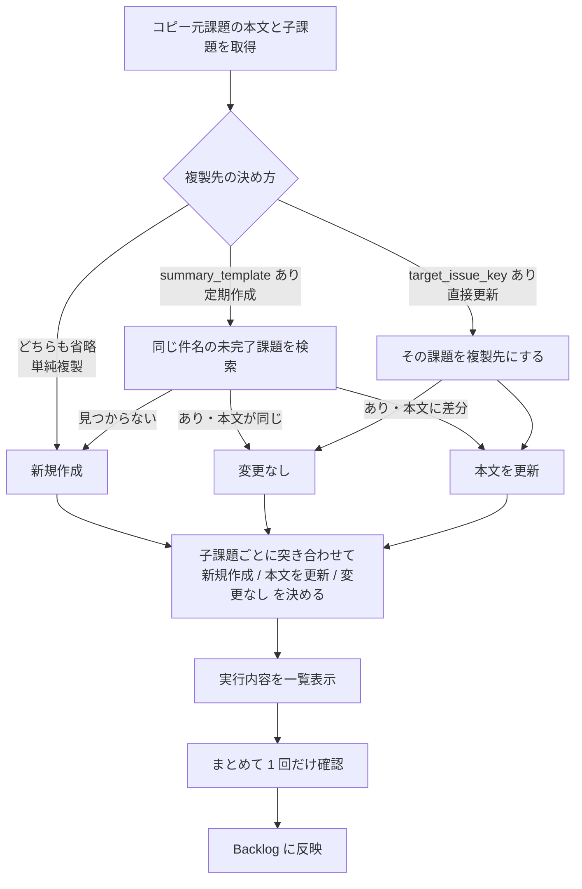

# Backlog 課題クローンツール

指定した Backlog 課題の本文（description）をコピーして、新しい課題を作成する CLI ツールです。
コピー元に**親課題を指定すると、その子課題もまとめて複製**します（[子課題の複製](#子課題の複製)を参照）。

設定によって、複製先の決め方が 3 通りに変わります（[3 つの動作モード](#3-つの動作モード)を参照）。

| モード | 用途 |
|---|---|
| **単純複製** | 課題を子課題ごとそのままコピーする |
| **定期作成** | 日付入りの件名で定期的に課題を立てる。既にあれば作らず本文だけ更新する |
| **直接更新** | 既存の課題群にコピー元の本文を反映し直す |

定例の週次タスクや日次点検を cron で自動化する場合は、**定期作成**モードを使います。

## 動作の流れ



親と子をあわせて何件作成・更新するかを表示し、**確認は 1 回だけ**です。
`--yes` を付けると省略され、ドライランではそもそも尋ねません。
確認が得られなかった場合は何もせず終了コード `20` を返します。

## セットアップ

Python 3.10 以上が必要です（`int | None` 形式の型注釈を使用しています）。

```bash
pip3 install pyyaml
```

設定ファイルを用意します。`config.yaml` は API キーを含むため `.gitignore` で除外されています。

```bash
cp config.sample.yaml config.yaml
```

`config.yaml` を開き、**必須の 3 項目**を設定してください。

- `backlog.space_host` — スペースのホスト名（例: `myteam.backlog.com`）
- `backlog.api_key` — API キー（Backlog の「個人設定 → API」で発行）
- `clone.source_issue_key` — コピー元にする課題のキー（例: `PROJ-123`）

これだけで**単純複製**モードとして動きます。定期実行したい場合は `clone.summary_template` に
`{YYYYMMDD}` を含む件名を設定してください（[3 つの動作モード](#3-つの動作モード)を参照）。

## 対話メニュー

`menu.py` を使うと、3 つのモードを選んで課題キーをその場で入力できます。
**設定ファイルには接続情報だけあればよく**、複製の対象は実行のたびに指定します。

```bash
python3 menu.py
```

```
============================================================
  Backlog 課題クローン
============================================================
  接続先: myteam.backlog.com

============================================================
  モードを選択
============================================================
  1. 単純複製 — 課題を子課題ごとそのままコピーする（毎回新規作成）
  2. 定期作成 — 日付入りの件名で作成する。既にあれば本文だけ更新する
  3. 直接更新 — 既存の課題（と子課題）にコピー元の本文を反映する
------------------------------------------------------------
  0. 終了
============================================================
```

モードを選ぶと、必要な項目だけを順に尋ねます。

| モード | 尋ねる項目 |
|---|---|
| 単純複製 | コピー元の課題キー |
| 定期作成 | コピー元の課題キー / 件名テンプレート / 日付 |
| 直接更新 | コピー元の課題キー / 複製先の課題キー |

- **件名テンプレートに `{YYYYMMDD}` が無い場合は日付を尋ねません。** 結果に影響しないためです。
- 日付は「今日 / 明日 / 来週の月曜 / 手動入力」から選べます。
- 前回入力した課題キーとテンプレートを覚えており、空 Enter でそのまま使えます
  （`~/.backlog_issue_cloner_menu.json`）。
- 最後にドライランか実行かを選びます。**実行内容の一覧と最終確認は本体が表示します。**
- 接続設定を切り替える場合は `python3 menu.py --config other.yaml`。

メニューは対話専用です。**無人実行には本体を直接使ってください**（[cron での自動実行](#cron-での自動実行)を参照）。

### 最低限の設定ファイル

メニューから使う場合、`config.yaml` は接続情報だけで足ります。

```yaml
backlog:
  space_host: "myteam.backlog.com"
  api_key: "YOUR_API_KEY_HERE"
```

## 使い方

デフォルトはドライランです。実際には何も作成・更新されません。

```bash
python3 backlog_issue_cloner.py
```

実際に作成・更新するには `--execute` を付けます。実行前に確認プロンプトが出ます。

```bash
python3 backlog_issue_cloner.py --execute
```

日付を指定する場合（省略時は今日）:

```bash
python3 backlog_issue_cloner.py --execute --date 20260401
```

### コマンドラインオプション

| オプション | 説明 |
|---|---|
| `--config PATH` | 設定ファイルのパス（デフォルト: 実行ファイルと同じ場所の `config.yaml`） |
| `--date YYYYMMDD` | 件名に埋め込む日付。省略時は今日 |
| `--execute` | 実際に API を呼び出す。省略時はドライラン |
| `-y`, `--yes` | 確認プロンプトを出さずに実行する（自動実行向け） |
| `--detailed-exit-code` | 正常終了時の結果を終了コードで区別する |
| `--debug` | API リクエストの詳細を表示する（API キーはマスクされます） |
| `--show-source` | コピー元のカスタム属性を表示して終了する（作成・更新はしない） |

### 設定の上書き

設定ファイルの `clone` セクションを実行時に上書きできます。設定ファイルに接続情報だけを置き、
複製の対象をコマンドラインで指定する使い方ができます（`menu.py` もこの仕組みで動いています）。

| オプション | 説明 |
|---|---|
| `--source-issue-key KEY` | コピー元の課題キー |
| `--target-issue-key KEY` | 複製先の課題キー（直接更新モードになる） |
| `--summary-template TEMPLATE` | 件名テンプレート（定期作成モードになる） |
| `--no-summary-template` | 設定ファイルの件名テンプレートを無視し、単純複製モードにする |

```bash
# 単純複製を 1 回だけ実行する
python3 backlog_issue_cloner.py --source-issue-key PROJ-123 --execute

# 既存の課題群にテンプレートの本文を反映し直す
python3 backlog_issue_cloner.py --source-issue-key PROJ-123 \
    --target-issue-key PROJ-456 --execute
```

`--summary-template` と `--no-summary-template` は同時に指定できません。

## 3 つの動作モード

`summary_template` と `target_issue_key` の指定によって、複製先の決め方が変わります。

| 設定 | モード | 動作 |
|---|---|---|
| どちらも省略 | **単純複製** | 重複チェックをせず、実行のたびに新しい課題を作る |
| `summary_template` あり | **定期作成** | その件名の課題を探し、無ければ作成・あれば更新 |
| `target_issue_key` あり | **直接更新** | 検索せずその課題を更新 |

### 単純複製（どちらも省略）

```yaml
clone:
  source_issue_key: "PROJ-123"
```

コピー元の件名をそのまま使い、**毎回新しい課題を作ります**。「この課題を子課題ごとコピーしたい」という単発の複製に使います。

複製先を特定する手掛かりが無いため重複チェックは行いません。**同じ設定で繰り返し実行すると、そのたびに課題が増えます。** cron で回す用途には向きません。

### 件名の決め方

`summary_template` で使えるプレースホルダは `{SOURCE_SUMMARY}`（コピー元の件名）と `{YYYYMMDD}`（`--date` または今日の日付）です。

| テンプレート | コピー元が「月次点検」の場合 | 重複チェック |
|---|---|---|
| 省略 | `月次点検` | **しない** |
| `{SOURCE_SUMMARY}` | `月次点検` | する |
| `【定期】{YYYYMMDD} タスク` | `【定期】20260909 タスク` | する |
| `{YYYYMMDD} {SOURCE_SUMMARY}` | `20260909 月次点検` | する |

省略と `{SOURCE_SUMMARY}` は**同じ件名になりますが動作が違います**。
コピー元と同じ件名で重複チェックしたい（既にあれば作らず更新したい）場合は、省略せずに `{SOURCE_SUMMARY}` と明記してください。この場合、コピー元自身は重複判定から自動的に除外されます。

なお `{YYYYMMDD}` を含めないと日付で区別できないため、2 回目以降は新規作成ではなく更新になります。実行のたびに別の課題を立てたい場合は `{YYYYMMDD}` を含めてください。

## 複製先を直接指定する

`target_issue_key` を指定すると、件名による検索を行わず**その課題（と、その子課題）を直接更新**します。
既に作成済みの課題群に、コピー元の本文を反映し直したいときに使います。

```yaml
clone:
  source_issue_key: "PROJ-123"    # コピー元（テンプレート）
  target_issue_key: "PROJ-456"    # 複製先（既存の課題）
```

```
  [親] 本文を更新  複製先の件名（PROJ-456）
  [子] 変更なし    手順1 バックアップ（PROJ-457）
  [子] 本文を更新  手順2 検証（PROJ-458）
  [子] 新規作成    手順3 報告
```

- **件名は変更しません。** 更新されるのは本文だけです。`summary_template` は使われません。
- 子課題は複製先の親に紐づく子課題と件名で照合し、**1 件ずつ**更新します。照合方法は `match_mode` に従います。
- コピー元にあって複製先に無い子課題は新規作成されます（上の例の「手順3 報告」）。
- **コピー元と同じプロジェクトの課題を指定してください。** 別プロジェクトの課題を指定するとエラーになります（[プロジェクトを跨いだ複製はできません](#プロジェクトを跨いだ複製はできません)を参照）。
- コピー元と同じ課題を指定した場合はエラーになります。

## プロジェクトを跨いだ複製はできません

**複製先は常にコピー元と同じプロジェクトです。** 別のプロジェクトへは複製できません。

更新系のツールを複数人で使う前提のため、プロジェクトを取り違えて課題を作ってしまう事故を
防ぐ方針にしています。

- 複製先のプロジェクトは、コピー元の課題キー（例: `PROJ-123`）から自動的に決まります。指定する項目はありません。
- `target_issue_key` に別プロジェクトの課題を指定すると、**何も変更せずエラーで停止**します。

```
エラー: コピー元（PROJ）とコピー先（DEST）のプロジェクトが異なります。プロジェクトを跨いだ複製には対応していません。
```

### `target_project_key` は廃止されました

以前の版にあった `clone.target_project_key` は使えません。
設定ファイルに残っていると、**黙って無視せずエラーで停止**します。
意図した別プロジェクトではなくコピー元のプロジェクトに作られてしまうのを防ぐためです。

```
エラー: config.yaml の clone.target_project_key は廃止されました。プロジェクトを跨いだ複製には対応していないため、この項目を削除してください。
```

## 実行例

いずれも `menu.py` からの操作です。コピー元は共通で次の構成とします。

```
PROJ-10  月次点検手順
├── PROJ-11  手順1 バックアップ
├── PROJ-12  手順2 検証
└── PROJ-13  手順3 報告
```

### 単純複製

コピー元だけを聞かれます。件名はコピー元のままで、子課題ごと新しく作られます。

```
番号を入力してください: 1

============================================================
  単純複製
============================================================
  コピー元の課題キー（空 Enter で戻る）: PROJ-10

============================================================
  実行モード
============================================================
  1. ドライラン（確認のみ・変更しません） ←既定
  2. 実行（Backlog に反映）
------------------------------------------------------------
  0. 戻る
============================================================
番号を入力してください [Enter=1]: 2

設定値:
  件名        : 月次点検手順
  コピー元    : PROJ-10
  対象PJ      : PROJ (id=10)
  本文文字数  : 10 文字
  重複判定    : 行わない（毎回新しい課題を作成）

実行内容:
  [親] 新規作成    月次点検手順
  [子] 新規作成    手順1 バックアップ
  [子] 新規作成    手順2 検証
  [子] 新規作成    手順3 報告
  Backlog に反映しますか？（新規作成 4 件） [y/N]: y
作成完了: PROJ-101 — 月次点検手順
  [子] 作成完了: PROJ-102 — 手順1 バックアップ
  [子] 作成完了: PROJ-103 — 手順2 検証
  [子] 作成完了: PROJ-104 — 手順3 報告
```

もう一度実行すると、重複チェックをしないため**さらに 4 件作られます**。

### 定期作成

件名テンプレートと日付を聞かれます。

```
番号を入力してください: 2

============================================================
  定期作成
============================================================
  コピー元の課題キー（空 Enter で戻る）: PROJ-10
  件名テンプレート [Enter=【定期】{YYYYMMDD} タスク]: 【定期】{YYYYMMDD} 月次点検

============================================================
  日付を選択
============================================================
  1. 今日 (2026-09-09) ←既定
  2. 明日 (2026-09-10)
  3. 来週の月曜 (2026-09-14)
  4. 手動入力 (YYYYMMDD)
------------------------------------------------------------
  0. 戻る
============================================================
番号を入力してください [Enter=1]: 1

設定値:
  件名        : 【定期】20260909 月次点検
  重複判定    : substring（完了済み課題を除く）

既存課題を検索中（件名: '【定期】20260909 月次点検'）...

実行内容:
  [親] 新規作成    【定期】20260909 月次点検
  [子] 新規作成    手順1 バックアップ
  [子] 新規作成    手順2 検証
  [子] 新規作成    手順3 報告
  Backlog に反映しますか？（新規作成 4 件） [y/N]: y
作成完了: PROJ-101 — 【定期】20260909 月次点検
```

**同じ日にもう一度実行**すると、既に作られたものが見つかり何もしません。
作成・更新が 0 件なので確認プロンプトも出ません。

```
既存課題を検索中（件名: '【定期】20260909 月次点検'）...
既存課題あり: PROJ-101

実行内容:
  [親] 変更なし    【定期】20260909 月次点検（PROJ-101）
  [子] 変更なし    手順1 バックアップ（PROJ-102）
  [子] 変更なし    手順2 検証（PROJ-103）
  [子] 変更なし    手順3 報告（PROJ-104）

変更はありません。
```

cron で毎日実行しても課題が重複しないのはこのためです。

### 直接更新

複製先の課題キーを聞かれます。**コピー元と同じプロジェクトの課題**を指定してください。
ここでは複製先 `PROJ-20` が次の状態だとします。

```
PROJ-20  9月 月次点検           ← 本文がコピー元と異なる
├── PROJ-21  手順1 バックアップ  ← 本文は同じ
└── PROJ-22  手順2 検証         ← 本文が古い
                               （「手順3 報告」は無い）
```

```
番号を入力してください: 3

============================================================
  直接更新
============================================================
  コピー元の課題キー（空 Enter で戻る）: PROJ-10
  複製先の課題キー（空 Enter で戻る）: PROJ-20

番号を入力してください [Enter=1]: 2

コピー元課題を取得中: PROJ-10
コピー元の子課題を取得中...
  子課題: 3 件
コピー先課題を取得中: PROJ-20

設定値:
  件名        : 9月 月次点検
  コピー元    : PROJ-10
  対象PJ      : PROJ (id=10)
  コピー先    : PROJ-20（件名は変更しません）
  子課題照合  : substring
既存課題あり: PROJ-20

実行内容:
  [親] 本文を更新  9月 月次点検（PROJ-20）
  [子] 変更なし    手順1 バックアップ（PROJ-21）
  [子] 本文を更新  手順2 検証（PROJ-22）
  [子] 新規作成    手順3 報告
  Backlog に反映しますか？（新規作成 1 件 / 本文更新 2 件） [y/N]: y
更新完了: PROJ-20 — 9月 月次点検
  [子] 更新完了: PROJ-22 — 手順2 検証
  [子] 作成完了: PROJ-101 — 手順3 報告
```

件名（`9月 月次点検`）は変わらず本文だけが更新され、**差分のある子課題だけ**が処理されます。
コピー元に増えていた「手順3 報告」は新規作成されます。

### 2 回目以降の入力

前回の入力を覚えているため、空 Enter で流せます。

```
  コピー元の課題キー [Enter=PROJ-10]:
  件名テンプレート [Enter=【定期】{YYYYMMDD} 月次点検]:
```

モード選択にも `←前回` が付き、そのまま Enter で選べます。

## 複製される項目

課題の**作成時**に引き継がれる項目です。Backlog の課題追加 API のパラメータと突き合わせています。

| 項目 | 引き継ぎ | 備考 |
|---|---|---|
| 件名 | ○ | 件名テンプレートを適用 |
| 本文（description） | ○ | |
| 種別 | ○ | `clone.issue_type` で上書き可 |
| 優先度 | ○ | `clone.priority` で上書き可 |
| 担当者 | ○ | `copy_attributes: false` で無効化 |
| カテゴリー | ○ | 同上 |
| マイルストーン | ○ | 同上 |
| 発生バージョン | ○ | 同上 |
| 予定時間 | ○ | 同上 |
| カスタム属性 | ○ | `copy_custom_fields: false` で無効化 |
| 親課題 | ○ | 子課題を複製先の親に紐づける |
| 実績時間 | × | 「実際に掛かった時間」のため複製しません |
| 添付ファイル | × | API 上、既存の ID を渡しても複製できません |
| 状態 / 完了理由 | × | 作成 API では指定できません（新規課題は「未対応」で作られます） |
| 開始日 / 期限日 | × | 複製すると毎回テンプレートの日付が入るため対象外にしています |

**引き継がれるのは作成時のみです。** 更新（定期作成の 2 回目以降、直接更新）では本文しか反映しません。

複製先で担当者を付け替えたりマイルストーンを設定したりしたものを上書きしないための仕様です。
そのため、**テンプレート側で担当者や種別を変更しても、既に作られている課題には反映されません。**

1 回の実行の中でも扱いが分かれます。

| 対象 | 反映される項目 |
|---|---|
| 既に複製先にある課題 | 本文のみ |
| 複製先に無く新しく作られる課題 | 上の表の「○」すべて |

## カスタム属性

**課題の作成時に、コピー元のカスタム属性の値を引き継ぎます。**

> **カスタム属性の必須設定は種別ごとです。**
> そのため、作成する課題の**種別**も既定でコピー元に揃えています。
> `clone.issue_type` で別の種別を指定すると、その種別で必須の属性が新たに要求されることがあります。

必須のカスタム属性があるプロジェクトでは、値を渡さないと作成が失敗します。

```
エラー: API呼び出しに失敗しました（HTTP 400）: /issues
  詳細: 作業完了チェックは必須です（code=7）
```

引き継ぎは既定で有効です。無効にする場合は `copy_custom_fields: false` を設定してください
（その場合、必須のカスタム属性があるプロジェクトでは上記のエラーになります）。

| 種別 | 引き継ぎ方 |
|---|---|
| 文字列 / 文章 / 数値 | 値をそのまま |
| 日付 | `2026-09-09T00:00:00Z` → `2026-09-09` に変換 |
| 単一リスト / ラジオボタン | 選択肢の ID |
| 複数リスト / チェックボックス | 選択肢の ID の配列 |
| 「その他」の入力値 | 併せて引き継ぐ |

値が空の属性は送りません。**必須の属性がコピー元でも空の場合は、引き継いでもエラーになります。**

### コピー元の値を確認する

`--show-source` でコピー元のカスタム属性を一覧表示できます。作成・更新は行いません。

```bash
python3 backlog_issue_cloner.py --source-issue-key PROJ-10 --show-source
```

```
コピー元課題: PROJ-10 — 月次点検手順
  カスタム属性:
    id=11  チェックボックス  '作業完了チェック'  値: （未設定）

  作成時に渡す値: なし

  値が未設定の属性があります（id=11）。
  これらが必須の場合、コピー元に値を入れるか、config.yaml の clone.custom_fields で指定してください。
```

### 値を指定する

コピー元に値が無い必須属性は、`clone.custom_fields` で補えます。
ここで指定した値は**コピー元から引き継いだ値より優先**されます。

```yaml
clone:
  custom_fields:
    11: [1]            # チェックボックス / 複数リスト: 選択肢 ID の配列
    12: 5              # 単一リスト / ラジオボタン: 選択肢 ID
    13: "備考テキスト"  # 文字列 / 文章
```

ID は `--show-source` で確認できます。親課題と子課題の双方に適用されます。

### 引き継ぐのは作成時のみです

**更新（定期作成の 2 回目以降、直接更新）では本文しか反映しません。**
既存の課題のカスタム属性は変更されません。

## 重複判定の挙動

`summary_template` を指定し、`target_issue_key` を指定しない場合（定期作成モード）に適用されます。
`summary_template` も省略した単純複製モードでは重複チェック自体を行いません。

「既存課題あり」と判断するかどうかは次の 2 つの設定で変わり、**意図せず新規作成がスキップされる原因になりやすい部分です。**

### `match_mode`

Backlog のキーワード検索は件名と本文の両方を対象とするため、検索結果を件名でさらに絞り込んでいます。その絞り込み方を指定します。

- **`substring`（デフォルト）** — 既存課題の件名に、生成した件名が「含まれて」いればヒットします。
  「`【定期】20260828 タスク`」は「`【定期】20260828 タスク（再発）`」にもヒットするため、**本来作るべき課題が既存扱いになることがあります。**
- **`exact`** — 件名が完全に一致した場合のみヒットします。上記の誤検出を避けたい場合はこちらを指定してください。

### `include_closed`

- **`false`（デフォルト）** — 状態が「未対応 / 処理中 / 処理済み」の課題のみを検索します。
  完了済みの課題はヒットしないため、**作成した課題を完了にした後に同じ日付で再実行すると、同じ件名の課題がもう 1 件作られます。**
- **`true`** — 完了済みの課題も検索対象に含めます。上記の重複は起きませんが、過去にクローズした同名課題にヒットして新規作成がスキップされる可能性があります。

## 子課題の複製

`source_issue_key` に親課題を指定すると、その子課題もまとめて複製します。
不要な場合は `include_children: false` を設定してください。

```yaml
clone:
  source_issue_key: "PROJ-123"          # 子課題を持つ親課題
  summary_template: "【定期】{YYYYMMDD} 月次点検"
```

コピー元が `PROJ-123`（子: 「手順1 バックアップ」「手順2 検証」）の場合:

```
  [親] 新規作成    【定期】20260909 月次点検
  [子] 新規作成    手順1 バックアップ
  [子] 新規作成    手順2 検証
```

### 子課題の件名

デフォルトでは**コピー元の子課題の件名をそのまま使います**。親課題と違い日付は付きません。
子課題は親課題に紐づいており、他の周回の子課題と混ざらないためです。

日付を入れたい場合は `child_summary_template` を指定します。

| テンプレート | 結果 |
|---|---|
| `{SOURCE_SUMMARY}`（デフォルト） | `手順1 バックアップ` |
| `{YYYYMMDD} {SOURCE_SUMMARY}` | `20260909 手順1 バックアップ` |

### 子課題の作成順

**子課題は件名の順に作成します。** Backlog API の返却順は一定ではないため、
そのまま使うと実行のたびに作成順が変わり、採番される課題キーの並びがまちまちになります。

数字は数値として比較するので、番号付きの手順が期待どおりに並びます。

| | 並び |
|---|---|
| 単純な文字列比較 | `手順1` → `手順10` → `手順2` |
| **このツール** | `手順1` → `手順2` → `手順10` |

件名が同じ子課題が複数ある場合は、コピー元の課題 ID 順に並べて順序を確定させます。
実行内容の一覧もこの順で表示されます。

### 子課題の重複判定

子課題の照合は、**複製先の親課題に紐づく子課題の中だけ**で行います。プロジェクト全体のキーワード検索は使いません。件名の照合方法は親と同じく `match_mode` に従います。

親課題の重複判定と違い、**完了済みの子課題も照合対象に含めます**（`include_closed` は子課題には適用されません）。既に完了した子課題を再作成してしまうのを避けるためです。

### 複製先で子課題の件名を変更した場合

照合は件名で行うため、**複製先で子課題の件名を変えると照合できず、同じ内容の子課題が重複して作られます。**
改名された既存の子課題は更新も削除もされず、そのまま残ります。

既定の `substring` は「コピー元の件名が複製先の件名に含まれるか」を見るため、改名の仕方によって結果が変わります。

| 複製先での改名（コピー元は `手順2 検証`） | `substring` | `exact` |
|---|---|---|
| `手順2 検証（改訂）`（前後に追記） | 照合できる | 重複作成 |
| `検証手順`（言い回しを変更） | 重複作成 | 重複作成 |
| `手順2`（一部を削除） | 重複作成 | 重複作成 |

重複を避けたい場合は、`substring` を使ったうえで**コピー元の件名を含む形で改名**してください。

照合できなかった子課題があり、かつ新規作成が発生する場合は、確認プロンプトの前に警告を表示します。

複製先の `PROJ-32` が「手順2 検証」から「検証手順」に改名されている場合の出力です。

```
実行内容:
  [親] 変更なし    【定期】20260909 月次点検（PROJ-30）
  [子] 変更なし    手順1 バックアップ（PROJ-31）
  [子] 新規作成    手順2 検証
  [子] 変更なし    手順3 報告（PROJ-33）

  警告: 複製先に照合できなかった子課題があります:
      PROJ-32: 検証手順
    複製先で件名が変更されていると照合できず、同じ内容の子課題が重複して作られます。
    重複させたくない場合はここで中断してください。
  Backlog に反映しますか？（新規作成 1 件） [y/N]:
```

意図しない重複であればここで `n` を選んで中断してください。
**`--yes` を付けた自動実行では警告がログに出るだけで、重複した子課題は作られます。**

新規作成が発生しない場合は警告しません。複製先に独自の子課題を追加していても、重複が起きないためです。

### 子課題に引き継がれるもの

| 項目 | 挙動 |
|---|---|
| 本文（description） | コピー元の子課題からコピー |
| 種別 | コピー元の子課題の種別をそのまま使う（親課題も同様にコピー元に揃えます） |
| 優先度 | コピー元の子課題の優先度をそのまま使う（優先度は Backlog スペース共通のため） |
| 親課題 | 複製先の親課題に紐づける |

`clone.issue_type` と `clone.priority` の設定は**親課題にのみ適用されます**。子課題はコピー元の子課題の設定に追随します。

### 制約

- Backlog の親子関係は 2 階層までです。孫課題は存在しないため、複製も 1 階層のみです。
- コピー元自身が子課題だった場合は、警告を出して親課題のみを複製します。

## 設定項目

### `backlog` セクション

| キー | 必須 | デフォルト | 説明 |
|---|---|---|---|
| `space_host` | ○ | — | スペースのホスト名（例: `myteam.backlog.com`） |
| `api_key` | ○ | — | API キー |
| `ssl_verify` | | `true` | SSL 証明書を検証する。オンプレ版で自己署名証明書を使う場合に `false` |
| `base_path` | | `""` | オンプレ版のパスプレフィックス（例: `/backlog`） |
| `timeout` | | `30` | 1 リクエストのタイムアウト秒数 |
| `max_retries` | | `3` | リトライ回数。`0` で無効 |
| `retry_backoff` | | `1.0` | 初回の待機秒数。以降 2 倍ずつ増える（1 → 2 → 4） |
| `retry_max_delay` | | `60.0` | 1 回あたりの待機秒数の上限 |

### `clone` セクション

| キー | 必須 | デフォルト | 説明 |
|---|---|---|---|
| `source_issue_key` | ○ | — | コピー元の課題キー（例: `PROJ-123`） |
| `summary_template` | | — | 件名テンプレート。省略するとコピー元の件名をそのまま使い、重複チェックも行わない（[3 つの動作モード](#3-つの動作モード)を参照） |
| `target_issue_key` | | — | 複製先の課題キー。指定すると件名で検索せずこの課題を直接更新する（[複製先を直接指定する](#複製先を直接指定する)を参照） |
| `issue_type` | | コピー元と同じ | 親課題の種別名。省略時はコピー元と同じ種別（複製先に無ければ最初の種別） |
| `priority` | | コピー元と同じ | 親課題の優先度名（`最高` / `高` / `中` / `低`）。省略時はコピー元と同じ優先度 |
| `match_mode` | | `substring` | 件名の照合方法（[重複判定の挙動](#重複判定の挙動)を参照） |
| `include_closed` | | `false` | 完了済み課題も重複判定の対象にするか（親課題のみに適用） |
| `include_children` | | `true` | 子課題もまとめて複製するか |
| `copy_attributes` | | `true` | 担当者・カテゴリー・マイルストーン・バージョン・予定時間を引き継ぐか（[複製される項目](#複製される項目)を参照） |
| `copy_custom_fields` | | `true` | カスタム属性をコピー元から引き継ぐか（[カスタム属性](#カスタム属性)を参照） |
| `custom_fields` | | — | カスタム属性の値を指定する（コピー元より優先） |
| `child_summary_template` | | `{SOURCE_SUMMARY}` | 子課題の件名テンプレート |

## エラー時のリトライ

一時的な障害は指数バックオフで自動的に再試行します（デフォルト 3 回）。

ただし**課題の作成・更新（POST / PATCH）では、リクエストがサーバに届いていないことが確実な失敗のみ再試行します。**
届いた後に失敗した可能性があるケースで再送すると、サーバ側では成功していたときに課題が二重に作られてしまうためです。

| 失敗の種類 | 参照系（GET） | 更新系（POST / PATCH） |
|---|---|---|
| HTTP 429（レート制限） | 再試行する | **再試行する**（拒否＝未処理が確実なため） |
| HTTP 500 / 502 / 503 / 504 | 再試行する | 再試行しない |
| 接続失敗（接続拒否・名前解決失敗など） | 再試行する | **再試行する**（サーバに届いていないため） |
| タイムアウト・接続断 | 再試行する | 再試行しない |

更新系で再試行しなかった場合は、その旨と「Backlog 側で処理済みの可能性があるため課題の状態を確認してから再実行してください」という案内を表示して終了コード `3` で終了します。

リトライ対象のレスポンスに `Retry-After` ヘッダ（秒数形式）があればその値を優先し、`retry_max_delay` を上限とします。HTTP-date 形式の `Retry-After` は解釈できないため、その場合は通常のバックオフにフォールバックします。

認証エラー（401）やパラメータ不正（400）は再試行せず、即座に終了コード `3` で終了します。

## 制限事項

- **プロジェクトを跨いだ複製はできません。** 複製先は常にコピー元と同じプロジェクトです。
- **開始日・期限日・実績時間・添付ファイルは複製されません**（[複製される項目](#複製される項目)を参照）。
- **属性が引き継がれるのは作成時のみ**で、更新では本文しか反映しません。
- **1 回の実行で扱えるコピー元は 1 件だけです。** 複数の定期課題を回す場合は設定ファイルを分け、それぞれ `--config` で指定して実行してください。
- **件名テンプレートのプレースホルダは `{SOURCE_SUMMARY}` と `{YYYYMMDD}` のみです。**
- 更新時に反映されるのは本文のみで、件名やその他の属性は変更しません（`target_issue_key` を指定した場合も同様です）。
- 親子関係は 2 階層までのため、複製も 1 階層のみです。
- 途中で API エラーが起きた場合、そこまでに作成・更新した課題は残ります（ロールバックはしません）。再実行すれば差分だけが反映されます。

## cron での自動実行

**`--yes` が必須です。** 付けないと確認プロンプトに応答できないため、何もせずスキップして終了コード 20 を返します。

毎週月曜 9:00 に実行する例:

```cron
0 9 * * 1 cd /path/to/backlog_issue_cloner && /usr/bin/python3 backlog_issue_cloner.py --execute --yes >> /var/log/backlog_cloner.log 2>&1
```

`--config` は相対パスだと実行時のカレントディレクトリに依存するため、`cd` するか絶対パスを指定してください。

### 終了コード

| コード | 意味 |
|---|---|
| `0` | 正常終了 |
| `2` | 設定エラー（設定ファイルが無い、必須項目が未設定、コピー元課題が存在しない など） |
| `3` | API / ネットワークエラー（リトライしても回復しなかった場合） |
| `20` | 確認が得られずスキップした（`--yes` なしの非対話実行、またはユーザーが拒否） |

`--detailed-exit-code` を付けると、正常終了時の `0` がさらに分かれます。

| コード | 意味 |
|---|---|
| `0` | 変更なし（既存課題があり、本文も同一） |
| `10` | 新規作成した |
| `11` | 本文を更新した |

子課題を含む場合は、親と子をあわせた結果を返します。作成が 1 件でもあれば `10`、
作成が無く更新が 1 件でもあれば `11`、すべて変更なしなら `0` です。

このフラグを付けない限り、作成・更新のいずれも `0` を返します。`command \|\| notify` のような監視と組み合わせても誤検知しません。結果に応じて処理を分けたい場合だけ付けてください。

`--execute` を付けないドライランでも、**これから何が起きるか**を同じコードで返します（作成される予定なら `10`、更新される予定なら `11`）。実行前の事前チェックに使えます。

```bash
python3 backlog_issue_cloner.py --execute --yes --detailed-exit-code
case $? in
  0)  echo "変更なし" ;;
  10) echo "課題を作成した" ;;
  11) echo "本文を更新した" ;;
  *)  echo "エラー" ;;
esac
```

## 開発

テストは外部通信なしで完結します。

```bash
python3 -m unittest discover -s tests -t .
```

カバレッジを測る場合:

```bash
pip3 install coverage
python3 -m coverage run --branch --source=backlog_issue_cloner,menu -m unittest discover -s tests -t .
python3 -m coverage report -m
```

メニューの対話ループ本体（`main`）は副作用が大きいため対象外にしています。

改修する場合は [設計仕様書](docs/DESIGN.md) を参照してください。
設計判断の根拠、Backlog API への依存、変更時に触る場所をまとめています。

## ファイル構成

| ファイル | 役割 |
|---|---|
| `README.md` | このドキュメント（使う人向け） |
| `docs/DESIGN.md` | 設計仕様書（保守する人向け。設計判断の根拠と変更ガイド） |
| `backlog_issue_cloner.py` | 本体（API クライアント + CLI） |
| `menu.py` | 対話メニュー（本体を subprocess で呼ぶ） |
| `config.sample.yaml` | 設定ファイルのテンプレート |
| `tests/test_backlog_issue_cloner.py` | 本体のユニットテスト |
| `tests/test_menu.py` | メニューのユニットテスト |
| `.gitignore` | `config.yaml` などを除外 |
| `config.yaml` | 実際の設定。API キーを含むため Git 管理外 |
