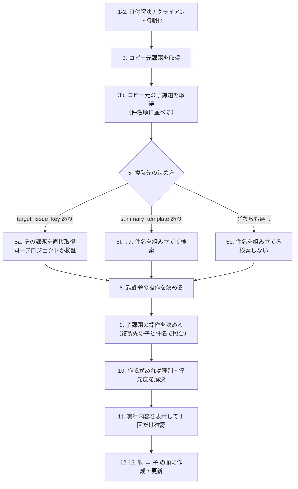

# 設計仕様書

このツールを**保守・改修する人**向けの文書です。

使い方・設定項目の一覧は [README.md](../README.md) にあります。
**この文書では使い方を再掲しません。** 二重に書くと必ず食い違うためです。
ここに書くのは「なぜそうなっているか」と「どこを触ればよいか」です。

---

## 1. 前提

このツールの設計判断は、次の 3 つの前提から導かれています。
**改修時はこの前提が変わっていないかを最初に確認してください。**

| 前提 | 帰結 |
|---|---|
| **定期課題の複製**が主目的 | 同じ課題を何度も作る／既にあれば作らない、という重複判定が要る |
| **更新系**のツール（Backlog を書き換える） | 失敗より「意図しない書き換え」の方が損害が大きい |
| **複数人が使う**（作った本人以外も動かす） | 暗黙の前提を残さない。危ない操作は既定で止める |

3 つ目が特に効いています。プロジェクトを跨いだ複製の禁止、廃止した設定項目をエラーにする、
更新系リクエストの再試行を制限する、といった判断はすべてこれが根拠です。

---

## 2. 全体構成

```
backlog_issue_cloner.py   本体（API クライアント + 複製ロジック + CLI）  1,584 行
menu.py                   対話メニュー                                     387 行
config.sample.yaml        設定ファイルのひな形
tests/                    ユニットテスト                                 3,277 行
docs/DESIGN.md            この文書
README.md                 利用者向けドキュメント
```

### 依存の向き

```
menu.py ──import──> backlog_issue_cloner.py   （設定の読み取り・日付検証のみ）
menu.py ──subprocess──> backlog_issue_cloner.py （実行）
```

**メニューは本体を subprocess で起動します。** import して関数を呼ぶ方が速いのに、そうしていません。

- 本体の終了コードがそのまま取れる
- 本体側の確認プロンプト（実行内容の一覧と y/N）がそのまま働く
- **本体は「引数で全部指定できる CLI」のまま保てる** — cron 経路がメニューの都合に影響されない

メニューは対話専用です。無人実行は本体を直接呼びます。メニューにバッチ機能を持たせると、
本体の CLI と同じことを二重に実装することになります。

### 本体の内部構造

| 層 | 主な要素 | 役割 |
|---|---|---|
| API クライアント | `BacklogClient` | HTTP・リトライ・エラー変換。Backlog の都合はここに閉じる |
| 変換 | `custom_field_params` / `inherited_issue_params` / `configured_custom_field_params` | 課題の応答 → 作成 API のパラメータ |
| 解決 | `resolve_issue_type_id` / `resolve_priority_id` / `resolve_date` | 設定・コピー元・既定値の優先順位を決める |
| 計画 | `build_child_plans` / `find_existing_by_summary` / `sort_issues_by_summary` | 何をするかを決める。**API を書き換えない** |
| 実行 | `run` / `_apply_child_plan` | 計画に従って作成・更新する |
| 設定 | `load_config` / `apply_cli_overrides` / `validate_config` | 設定の読み込みと検証 |

**「計画」と「実行」を分けているのが構造の要**です。先に全体の計画を立てるので、
実行内容を一覧表示でき、確認を 1 回にまとめられます。計画段階では Backlog を書き換えません。

---

## 3. 処理の流れ

`run()` の中には `# 1.` 〜 `# 13.` の番号付きコメントがあります（子課題の取得は `# 3b.`）。
以下の図はそれと対応しています。



### 段階の意図

| 段階 | 意図 |
|---|---|
| 3b で子課題を**件名順に並べる** | API の返却順は一定でない。並べないと実行のたびに採番される課題キーの順が変わる |
| 5 で複製先を先に確定する | 3 モードの分岐をここ 1 箇所に閉じ込める |
| 9 まで API を書き換えない | 計画を全部立ててから確認するため |
| 10 で初めて種別・優先度を解決 | 作成が無ければ不要。更新・変更なしの経路で API 呼び出しを 2 回節約する |
| 12 で親を先に作る | 子の `parentIssueId` に親の ID が要る |

---

## 4. Backlog API への依存

呼んでいるのは 5 エンドポイントだけです。
**このツールの不具合の大半は、ここの理解のずれから来ています。**

| 用途 | エンドポイント | メソッド |
|---|---|---|
| 課題の取得 | `/issues/:issueIdOrKey` | GET |
| 課題の検索・子課題の取得 | `/issues` | GET |
| 種別一覧 | `/projects/:key/issueTypes` | GET |
| 優先度一覧 | `/priorities` | GET |
| 課題の作成 | `/issues` | POST |
| 課題の更新 | `/issues/:issueIdOrKey` | PATCH |

### 応答のどのフィールドに依存しているか

課題の応答からこれらを読んでいます。**Backlog 側の仕様変更はテストでは検知できません。**

| フィールド | 用途 |
|---|---|
| `id` / `issueKey` | 課題の識別、プロジェクトキーの導出、親子の紐づけ |
| `projectId` | 作成先プロジェクト |
| `summary` / `description` | 件名の照合、本文の複製 |
| `parentIssueId` | コピー元が子課題かどうかの判定、子課題の照合 |
| `issueType.name` | 複製先の種別を**名前で**解決する |
| `priority.id` | 優先度をそのまま引き継ぐ（優先度はスペース共通） |
| `assignee.id` / `category[].id` / `versions[].id` / `milestone[].id` | 属性の引き継ぎ |
| `estimatedHours` | 予定時間の引き継ぎ |
| `customFields[]` の `id` / `fieldTypeId` / `value` / `otherValue` | カスタム属性の引き継ぎ |

### 押さえておくべき API の性質

- **プロジェクトキーは `issueKey` の末尾ハイフンで分割して得る。** 単一課題の応答に
  プロジェクトキーは含まれず `projectId`（数値）しかないため。
- **種別 ID はプロジェクトごとに異なる。** だから名前で解決し直しています。
  優先度 ID はスペース共通なのでそのまま使えます。
- **課題の作成 API に `statusId` は無い。** 新規課題は必ず「未対応」で作られます。
  完了状態は複製されません。
- **カスタム属性の必須設定は種別ごと。** 種別を取り違えると、コピー元では不要な属性が
  必須になり作成が失敗します（[6. 落とし穴](#6-落とし穴)）。

---

## 5. 設計判断と根拠

**理由が分からないと「無駄な制限」と見えて外されます。** 外すと事故に直結するものが含まれます。

### 5.1 複製先はコピー元と同じプロジェクトに限定する

跨いだ複製は実装できます（実際に一度動いていました）。禁止したのは**事故防止**です。
複数人が使う更新系ツールで、プロジェクトを取り違えて課題を作ると回収が面倒です。

- `clone.target_project_key` は**廃止**。設定に残っていると黙って無視せず `ConfigError` で止めます。
  無視すると、指定した人の意図に反してコピー元のプロジェクトに作られてしまうためです。
- `target_issue_key` に別プロジェクトの課題を指定した場合も、**API を呼ぶ前に**止めます。

この制限のおかげで、カテゴリー・マイルストーン・バージョンの ID をそのまま複製できています。

### 5.2 種別・優先度はコピー元から引き継ぐ

`clone.issue_type` / `clone.priority` を設定していない場合、以前は
「プロジェクトの最初の種別」「中」を使っていました。これが実際に不具合を起こしました。

**カスタム属性の必須設定は種別ごとです。** コピー元が「タスク」でも、プロジェクトの
最初の種別が「バグ」で、バグ種別に必須のカスタム属性があると、作成が 400 で失敗します。

解決の優先順位は「設定 → コピー元 → 既定」です。子課題は元々コピー元から引き継いでおり、
親だけ挙動が違っていました。**同種の非対称は他にもないか、変更時に確認してください。**

### 5.3 更新では本文しか反映しない

複製先で担当者を付け替えたりマイルストーンを設定したりしたものを、
テンプレート側の値で上書きしないためです。

帰結として、**テンプレートの担当者や種別を変えても既存の課題には反映されません。**
1 回の実行の中でも「既にある課題は本文のみ / 新しく作る課題は全項目」と扱いが分かれます。

設定で同期範囲を選べるようにする案もありましたが、**汎用的にすると分かりづらくなる**ため
採用していません。

### 5.4 更新系リクエストは「届いていないことが確実な失敗」のみ再試行する

課題の作成中に 5xx やタイムアウトが起きたとき再送すると、
サーバ側では成功していた場合に**課題が二重に作られます**。

| 失敗の種類 | 参照系 | 更新系 |
|---|---|---|
| 429（レート制限） | 再試行 | **再試行**（拒否＝未処理が確実） |
| 5xx | 再試行 | しない |
| 接続失敗（`URLError`） | 再試行 | **再試行**（送信できていない） |
| タイムアウト・接続断 | 再試行 | しない |

`URLError` は接続・送信段階の失敗、それ以外の `OSError` は送信後の失敗という区別に依っています。

### 5.5 確認は 1 回にまとめる

課題ごとに確認すると、子課題が 10 件あれば 11 回聞かれます。
実行内容を一覧表示して「新規作成 3 件 / 本文更新 1 件」とまとめて確認します。

そのために「計画」と「実行」を分けています（[2. 全体構成](#2-全体構成)）。

### 5.6 `include_closed` は親課題にのみ適用する

子課題は**常に完了済みも照合対象**に含めます。

- 親課題は件名でプロジェクト全体を検索するため、過去にクローズした同名課題への誤爆がある
- 子課題は複製先の親に紐づくものだけを見るので誤爆の余地がない。
  むしろ**完了した子課題を再作成してしまう方が実害が大きい**

なお、完了済みの複製先を更新した場合、状態は完了のまま本文だけが変わります（差し戻りません）。

### 5.7 子課題は件名順に複製する

API の返却順は一定でないため、そのまま使うと実行のたびに採番される課題キーの並びが変わります。

数字は**数値として**比較します。単純な文字列比較では `手順1 → 手順10 → 手順2` となり、
番号付きの手順が期待どおりに並びません。件名が同じ場合は課題 ID で順序を確定させます。

### 5.8 `summary_template` を省略したら重複チェックをしない

省略時はコピー元の件名をそのまま使います。このとき複製先を特定する手掛かりが無いため、
検索せず毎回新規作成します（単純複製モード）。

**`summary_template: "{SOURCE_SUMMARY}"` と明記した場合は重複チェックします。**
生成される件名は同じですが動作が違います。明記した場合のみ、コピー元自身を検索結果から
除外する必要があります（同じ件名なので自分自身がヒットするため）。

---

## 6. 落とし穴

実際に踏んだものです。

### `code 7` は多義的

Backlog は HTTP 400 のエラーコード 7 を、
**「変更なし」と「必須項目エラー」の両方**で返します。

現在の実装は、更新（PATCH）で 400 + code 7 が返ったとき「変更なし」と解釈しています。
つまり**必須項目エラーを変更なしと取り違えて正常終了する可能性が残っています。**

暫定対応として、変更なしと判断した際にサーバのメッセージを併記しています。

```
スキップ（変更なしと判断）: PROJ-99 — 作業完了チェックは必須です（code=7）
```

**未解決の課題です。** Backlog 側で判別可能な情報が得られれば厳密化できます。

### 課題一覧の応答にカスタム属性が含まれないことがある

`GET /issues`（一覧）と `GET /issues/:key`（単一）で応答の内容が異なる場合があります。
子課題を作成する際、`customFields` キーが無ければ課題を取得し直しています。

### プロジェクトキーは数字やアンダースコアで始まれる

`10_AAA-20` のような課題キーが実在します。メニューの入力検証で先頭を英字に限定していて、
弾かれる不具合がありました。

### 端末表示は全角幅を考慮する

`新規作成`（4 文字）と `本文を更新`（5 文字）を文字数で詰めると桁がずれます。
`display_width` / `pad` で表示幅を数えて揃えています。

---

## 7. 変更ガイド

**テストと README も同時に直してください。** 実装だけ変えるとドキュメントがずれます。

### 複製する項目を増やす

1. `inherited_issue_params()` に変換を追加（作成 API のパラメータ名に合わせる）
2. `tests/test_backlog_issue_cloner.py` の `TestInheritedIssueParams` にテストを追加
3. README の「複製される項目」の表を更新
4. 引き継がない判断をした場合も、**理由を表に書く**

### 設定項目を増やす

1. `run()` で読む
2. `validate_config()` で型・値を検証する（**黙って無視しない**）
3. `config.sample.yaml` にコメント付きで追加
4. README の設定項目表に追加
5. `tools/check_docs.py` で 3 者の一致を確認

### 動作モードを増やす

`run()` の段階 5（複製先の確定）の分岐に追加します。
モードの判定は**この 1 箇所に閉じています**。README の「3 つの動作モード」の表と
`docs/DESIGN.md` の処理フロー図も更新してください。

### Backlog API の呼び出しを追加する

`BacklogClient` にメソッドを足します。HTTP・リトライ・エラー変換はすべて `_request()` に
集約されているので、`_get` / `_send` を経由してください。
**更新系を追加する場合は `idempotent=False` を渡す**のを忘れないでください（[5.4](#54-更新系リクエストは届いていないことが確実な失敗のみ再試行する)）。

---

## 8. テスト方針

```bash
python3 -m unittest discover -s tests -t .
```

352 件。カバレッジは本体 92% / `menu.py` 84%（branch カバレッジ込み）。

### 何を守っているか

カバレッジ率は「テストが実際に退行を捕まえるか」を表しません。
実装にわざとバグを埋め込んでテストが落ちるかを測る**ミューテーションテスト**で確認しています。

過去に実際に起きた不具合（種別を引き継がない、子課題を並べ替えない、
更新系で 5xx を再試行する、など）を含む 20 件の変異を全件検知しています。

### 対象外

副作用が大きい、または形式的なテストにしかならない箇所です。

| 箇所 | 理由 |
|---|---|
| `menu.py` の `main()` | 対話ループ |
| `ssl_verify: false` の分岐 | SSL コンテキストの構築のみ |
| `--debug` の出力内容 | 手動で確認（API キーがマスクされることは確認済み） |
| `get_project` / `get_issue_types` の 1 行委譲 | モックで通すだけになる |

### テストで守れないもの

**Backlog API の実際の仕様。** テストはスタブに対して動くため、
API の応答形式や必須項目の扱いが想定と違っても検知できません。
今回の「種別ごとにカスタム属性の必須設定が違う」はこれに当たります。

そのため `--show-source` のような**診断手段**を用意しています。
API 起因の問題は、テストではなく診断とエラーメッセージで対処する方針です。

---

## 9. 未解決の事項

| 事項 | 状況 |
|---|---|
| `code 7` の多義性 | 必須項目エラーを「変更なし」と誤認する可能性が残る（[6](#6-落とし穴)） |
| 開始日・期限日の複製 | 未対応。そのまま複製するとテンプレートの日付が入るため、相対指定の設計が要る |
| 添付ファイルの複製 | 未対応。API 上、既存の ID を渡しても複製できない（ダウンロードと再アップロードが要る） |
| 途中で失敗した場合のロールバック | 行わない。作成・更新済みの課題は残る。再実行すれば差分だけが反映される |
